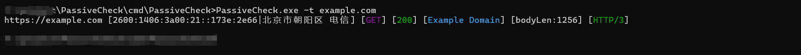
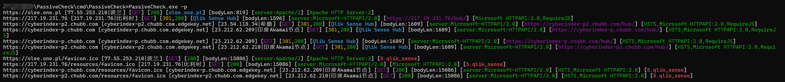
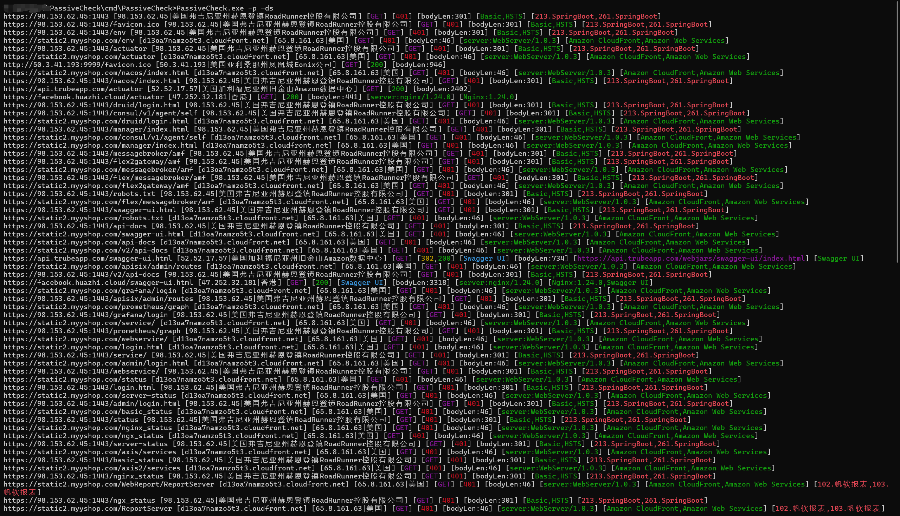
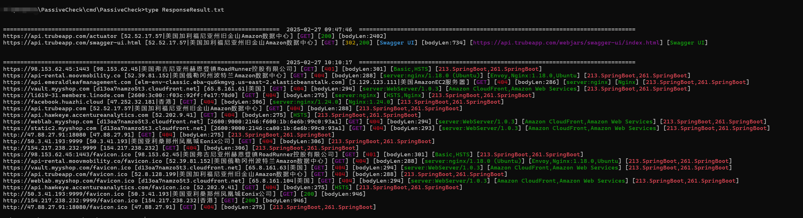
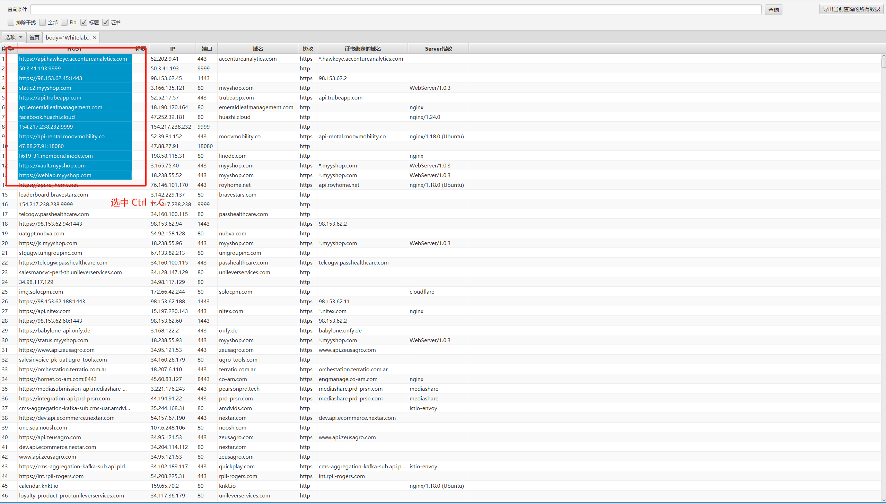
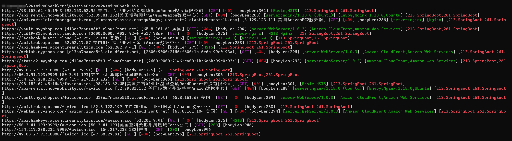

## PassiveCheck

PassiveCheck是一款基于httpx二开的被动指纹识别工具。在红队评估/渗透测试中，以最少的流量请求，快速搜集、验证资产信息


## 引言

在红队评估/渗透测试中，为了快速搜集资产信息，一般都会优先使用fofa、hunter等空间引擎工具。通过这些工具收集出来的资产有些已经失效了，有些是301 302跳转，有些是空白界面。遇到这种情况下，一般只能打开浏览器访问目标网站来，获取网站的相关信息，效率比较低下，偶尔还会错漏一些重要的系统


## 主要功能/特性

1、基于httpx二开：参数基本兼容，可以根据自身需求去指定参数，获取输出内容信息

2、剪切板导入资产：通过 -p 参数，批量导入资产，方便对于fofa、hunter等工具导出来的资产进行批量请求

3、输出cname、cdn、IP、归属地、状态码、title、server等相关信息

4、被动指纹识别：默认模式下，只需要发送一次包，根据response body、header、图标等信息进行指纹识别，主要包含一些常见的cms、oa系统

5、指纹信息输出：对于一些扫出来的指纹，通过参数可以查看指纹的详细信息

6、二级路由扫描：指定 -ds -dds参数，低线程扫描一些常见的二级路由，比如/login、 /admin，支持自定义字典，可通过 -dc 来指定，还可以通过设置delay time来逃避waf规则检测

7、空白界面的处理：有些情况下，服务器返回200 ，浏览器通过js脚本可以跳转到登录界面，而一般的扫描器一般不支持渲染html文件，无法跳转，从而输出一些空白的title，导致错过一些重要的系统

8、支持添加指纹，通过-ff可指定指纹库，默认使用的指纹库、指纹库格式：https://github.com/0x727/FingerprintHub/blob/main/web_fingerprint_v4.json


## 快速使用：

### 1.通过 -t 指定单个参数

```
PassiveCheck.exe -t example.com
```




### 2.通过剪贴板，指定参数-p批量导入资产

```
PassiveCheck.exe -p
```




### 3.通过 -ds 或者 -dss参数，可对目标发起二级目录扫描。可通过参数-dc指定二级目录字典

```
PassiveCheck.exe -p -ds
```




### 4.查看历史扫描记录

历史扫描记录保存在当前文件夹的ResponseResult.txt，Windows cmd命令行需要先切换到utf-8编码格式，再打印文件内容，否则会出现乱码

```
chcp 65001
type ResponseResult.txt
```




### 5.搭配fofa、hunter等工具使用

FofaTools 基于fofaview 二开的，主要修改了表格可以自由点击和复制，将所需目标复制出来




通过配合passivecheck -p 快速扫描资产




### 6.更新、指定指纹库

更新指纹库

```
PassiveCheck.exe -uf
```

指定指纹库文件

```
PassiveCheck.exe -ff FingerprintHub.txt -t www.example.com
```


### 7.其他用法

httpx的参数都有保留，没怎么变动过。在目录扫描模式下，可能存在大量的干扰数据。可通过设置参数来过滤结果，比如过滤401、403，还可以过response body 为空的web资产


## 免责声明

本工具仅面向**合法授权**的企业安全建设行为，如您需要测试本工具的可用性，请自行搭建靶机环境。

在使用本工具进行检测时，您应确保该行为符合当地的法律法规，并且已经取得了足够的授权。**请勿对非授权目标进行扫描。**

如您在使用本工具的过程中存在任何非法行为，您需自行承担相应后果，我们将不承担任何法律及连带责任。

除非您已充分阅读、完全理解并接受本协议所有条款，否则，请您不要安装并使用本工具。您的使用行为或者您以其他任何明示或者默示方式表示接受本协议的，即视为您已阅读并同意本协议的约束。
